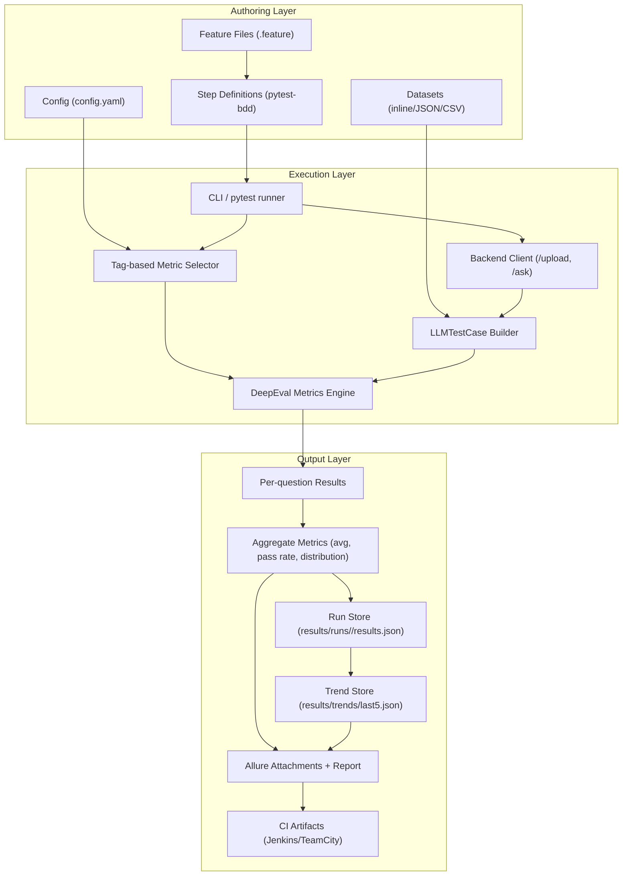
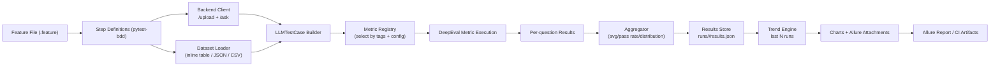
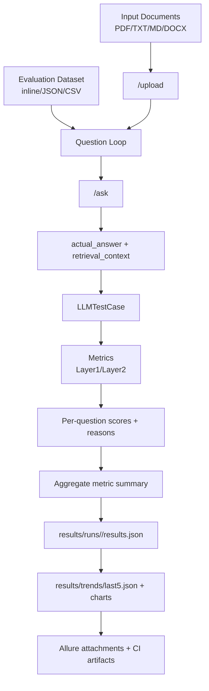

# RAG Eval BDD Framework

A production-grade Python framework for evaluating RAG systems using:

- `pytest`
- `pytest-bdd` (Cucumber-style Given/When/Then)
- `deepeval` metrics
- `allure-pytest` reporting
- persistent run history + trend comparison (last N runs)

This framework is isolated under `rag_eval_bdd/` and **does not modify notebooks**.

## Quick Start (60 seconds)

```bash
git clone <your-repo-url>
cd rag-session-qa-eval
source .venv/bin/activate   # reuse existing repo venv if available
cd rag_eval_bdd
python -m pip install -r requirements.txt
export BASE_URL="http://localhost:8000"
export OPENAI_API_KEY="your_openai_key"
make smoke
make live
make live-notebook-parity
```

Use `make ci` for a stable pipeline flow (`smoke` gate + non-blocking `live`).

---

## BDD Framework Architecture (Quick Access)

If your IDE does not render Mermaid, use the ASCII architecture right below the Mermaid diagram.



```text
AUTHORING LAYER
  Feature Files + Step Definitions + Config + Datasets
                    |
                    v
EXECUTION LAYER
  pytest/CLI -> tag-based metric selection -> backend (/upload,/ask)
                           -> LLMTestCase -> DeepEval metric execution
                    |
                    v
OUTPUT LAYER
  per-question results -> aggregates -> run store -> trend store
                                     -> Allure report -> CI artifacts
```

---

## 1) Repository Setup

### 1.1 Clone the repository

```bash
git clone <your-repo-url>
cd rag-session-qa-eval
```

### 1.2 Required tools

- Python `3.11+`
- `pip`
- `venv`
- Java (required by Allure CLI)
- Allure CLI (optional but recommended for local report generation)
- OpenAI API key for live DeepEval metric runs (`OPENAI_API_KEY`)

Check versions:

```bash
python3 --version
pip --version
java -version
```

### 1.3 Install framework dependencies

Preferred (reuse existing repo-level virtual environment):

```bash
cd rag_eval_bdd
source ../.venv/bin/activate
python -m pip install --upgrade pip
python -m pip install -r requirements.txt
```

If `../.venv` does not exist, create a local environment:

```bash
cd rag_eval_bdd
python3 -m venv .venv
source .venv/bin/activate
python -m pip install --upgrade pip
python -m pip install -r requirements.txt
```

### 1.4 Configure environment

Set the backend URL and optional runtime settings:

```bash
export BASE_URL="http://localhost:8000"
export OPENAI_API_KEY="your_openai_key"  # required for live metric evaluation
export API_KEY=""                         # optional backend auth header
export MODEL="gpt-4.1-mini"              # optional
export EMBED_MODEL=""                    # optional
export RAG_EVAL_CONFIG="rag_eval_bdd/config/config.yaml"  # optional override
```

You can set these in repo-level `.env` or `rag_eval_bdd/.env`; the framework auto-loads both.

---

## 2) Workflow Diagram (End-to-End)



---

## 3) Data Flow Diagram (Input → Processing → Output)



---

## 4) Project Structure Overview

```text
rag_eval_bdd/
├── config/
│   └── config.yaml
├── features/
│   ├── layer1_context_metrics.feature
│   └── layer2_answer_metrics.feature
├── steps/
│   └── test_eval_steps.py
├── src/rag_eval_bdd/
│   ├── __main__.py
│   ├── backend_client.py
│   ├── cli.py
│   ├── config_loader.py
│   ├── dataset_loader.py
│   ├── evaluator.py
│   ├── metric_registry.py
│   ├── models.py
│   ├── reporting.py
│   ├── results_store.py
│   └── synthesize.py
├── data/
│   ├── datasets/
│   ├── generated/
│   └── source/
├── results/
│   ├── index.json
│   ├── runs/
│   └── trends/
├── tests/
│   ├── test_config_loader.py
│   ├── test_dataset_loader.py
│   ├── test_evaluator_modes.py
│   ├── test_reporting.py
│   └── test_results_store.py
├── jenkins/
│   └── Jenkinsfile
├── teamcity/
│   ├── README.md
│   └── settings.kts
├── Makefile
├── pytest.ini
└── requirements.txt
```

### What goes where

- `features/`: business-readable BDD scenarios.
- `steps/`: step implementation code (Given/When/Then bindings).
- `data/datasets/`: reusable static test datasets.
- `data/generated/`: synthesized datasets (generated by CLI).
- `results/runs/`: immutable run snapshots.
- `results/trends/`: computed trend artifacts/charts.
- `tests/`: unit tests for framework internals (non-network).

---

## 5) Configuration

Primary config file:

- `rag_eval_bdd/config/config.yaml`

Important sections:

- `backend`: base URL, endpoints, retries, timeout.
- `thresholds`: pass/fail criteria by metric.
- `reporting`: run retention and trend chart toggles.
- `synthesize`: default generation settings.
- `evaluation`: token/cost controls for metric execution.

### Cost-optimized defaults

The framework is now cost-optimized by default:

- default eval model: `gpt-4.1-mini`
- metric `reason` generation disabled unless enabled
- retrieval context trimmed before metric evaluation
- document upload/session reuse across scenarios for same document
- `/ask` response cache reuse for repeated `(session_id, question)` pairs
- DeepEval retry attempts reduced to `1` (no extra retry call)

Useful overrides:

- `MODEL=gpt-4.1` (or any supported model)
- `RAG_EVAL_INCLUDE_REASON=1`
- `RAG_EVAL_MAX_CONTEXT_CHUNKS=3`
- `RAG_EVAL_MAX_CONTEXT_CHARS_PER_CHUNK=1200`
- `RAG_EVAL_DEEPEVAL_RETRY_MAX_ATTEMPTS=2`
- `RAG_EVAL_CACHE_UPLOADED_DOCUMENTS=0`
- `RAG_EVAL_CACHE_ASK_RESPONSES=0`
- `RAG_EVAL_FRESH_SESSION_PER_QUESTION=1`
- `RAG_EVAL_DISABLE_CONTEXT_TRIMMING=1`
- `RAG_EVAL_METRIC_QUESTION_MAPPING_MODE=all|positional|row`

### Notebook parity mode

Use this mode when you want live BDD behavior to be close to the notebooks:

- thresholds auto-set to `0.50`
- fresh upload/session per question
- context trimming disabled
- reason text enabled
- cost optimization disabled
- positional metric-question mapping (row1->metric1, row2->metric2, row3->metric3 when counts match)

Enable with:

- `RAG_EVAL_NOTEBOOK_PARITY_MODE=1`
- or `make live-notebook-parity`

### Threshold policy

Thresholds are **only** in config, not in feature files. This keeps business scenarios clean and allows centralized quality control.

---

## 6) Test Case Guidelines

### 6.1 Writing new test cases

Use either:

1. Inline dataset tables in feature files.
2. External dataset files (`JSON/CSV`) loaded by a step.

### 6.2 Naming conventions

- Feature file: `<layer>_<intent>.feature`
  - Example: `layer2_answer_metrics.feature`
- Scenario names: explicit business intent
  - Example: `Evaluate layer2 answer metrics from external dataset file`
- Dataset ids: stable and traceable
  - Example: `L2_EXT_001`

### 6.3 Best practices

- Keep one scenario focused on one evaluation objective.
- Reuse dataset files for stable regression coverage.
- Add category/topic fields to slice failures quickly.
- Keep expected answers concise and factual.
- Avoid overfitting thresholds to one run.

---

## 7) Feature File Creation (Gherkin)

### 7.1 Minimal template

```gherkin
@layer2 @answer_relevancy @faithfulness
Feature: Layer 2 answer quality

  Scenario: Evaluate answer metrics
    Given backend is reachable
    And documents are uploaded from "eval/sample_docs/Match_Summary.pdf"
    And I load dataset "rag_eval_bdd/data/datasets/layer2_questions.json"
    When I evaluate all questions
    Then metric "answer_relevancy" should be >= configured threshold
    And metric "faithfulness" should be >= configured threshold
    And save results for reporting
```

### 7.2 Inline table example

```gherkin
And I use inline dataset:
  """
  | id   | question                             | expected_answer                    | category |
  | Q001 | How many sixes did Tilak Varma hit? | Tilak Varma hit 3 sixes.          | batting  |
  | Q002 | Who dismissed Suryakumar Yadav?     | Kwena Maphaka dismissed Surya.    | wickets  |
  """
```

### 7.3 Readability and reuse tips

- Keep Given steps generic and reusable.
- Put large datasets in files, not inline.
- Use tags to control metric scope.
- Keep scenarios short; move heavy details to data files.

---

## 8) Step Definitions

Step bindings are in:

- `rag_eval_bdd/steps/test_eval_steps.py`

### 8.1 Binding pattern

- `@given(...)` prepares backend/session/data.
- `@when(...)` executes evaluation loop.
- `@then(...)` asserts aggregate thresholds and persists artifacts.

### 8.2 Typical organization pattern

- Input setup steps
- Execution step(s)
- Assertion steps
- Persistence/reporting step

### 8.3 New step template

```python
from pytest_bdd import given, when, then, parsers

@given(parsers.parse('I set category "{category}" filter'))
def set_category_filter(category, scenario_state):
    scenario_state.category_filter = category

@when("I evaluate filtered questions")
def evaluate_filtered(...):
    ...

@then(parsers.parse('metric "{metric_name}" pass rate should be >= {min_rate:f}%'))
def assert_pass_rate(metric_name, min_rate, scenario_state):
    ...
```

---

## 9) Dataset Creation and Management

### 9.1 Supported formats

- JSON (`.json`)
- CSV (`.csv`)
- text lines (`.txt`, `.md`) for basic loading/synthesis context extraction

### 9.2 Recommended dataset schema

```json
[
  {
    "id": "L2_EXT_001",
    "question": "How many sixes did Tilak Varma hit?",
    "expected_answer": "Tilak Varma hit 3 sixes.",
    "category": "batting",
    "source_reference": "Match_Summary.pdf"
  }
]
```

### 9.3 CSV schema

```csv
id,question,expected_answer,category,source_reference
L2_EXT_001,How many sixes did Tilak Varma hit?,Tilak Varma hit 3 sixes.,batting,Match_Summary.pdf
```

### 9.4 Data reuse guidelines

- Keep canonical datasets under `data/datasets/`.
- Keep generated datasets under `data/generated/`.
- Use stable IDs for trend comparison and triage.
- Version control curated datasets.

---

## 10) Synthetic Dataset Generation (DeepEval Synthesizer)

Generate from folder/file/dataset:

```bash
cd rag_eval_bdd
python -m rag_eval_bdd synthesize \
  --input data/source/ \
  --output data/generated/questions.json \
  --num-questions 50
```

Generated output fields:

- `id`
- `question`
- `expected_answer` (optional)
- `category` (optional)
- `source_reference` (optional)

---

## 11) Execution and Reports

### 11.1 Test execution

Note: run `pytest` against `steps/` (not `features/`) because `pytest-bdd` scenarios are materialized from Python step modules.

Recommended (via Makefile):

```bash
cd rag_eval_bdd
make smoke              # deterministic and stable
make live               # live backend + LLM metrics
make live-notebook-parity  # notebook-like behavior for live demo parity
make ci                 # smoke gate + live non-blocking
```

Deterministic smoke suite (stable CI gate, no live LLM/backend dependency):

```bash
cd rag_eval_bdd
python -m pytest -c pytest.ini tests -m "smoke" -q
```

Live BDD evaluation suite:

```bash
python -m pytest -c pytest.ini steps -m "live" --alluredir=allure-results
```

Notebook-parity live run:

```bash
RAG_EVAL_NOTEBOOK_PARITY_MODE=1 python -m pytest -c pytest.ini steps -m "live" --alluredir=allure-results
```

Run all live features:

```bash
python -m pytest -c pytest.ini steps --alluredir=allure-results
```

Live suite as non-blocking quality signal:

```bash
python -m pytest -c pytest.ini steps -m "live" --alluredir=allure-results || true
```

By default, the framework now does this automatically for every run (when `--alluredir` is present):

- clears old `allure-results/` and `allure-report/`
- generates a fresh `allure-report/`
- opens the report in browser via `allure open` (local HTTP server)

Run layer-specific:

```bash
python -m pytest -c pytest.ini steps -m "layer1" --alluredir=allure-results
python -m pytest -c pytest.ini steps -m "layer2" --alluredir=allure-results
```

Run metric subset:

```bash
python -m pytest -c pytest.ini steps -m "faithfulness or completeness" --alluredir=allure-results
```

Run via CLI wrapper:

```bash
python -m rag_eval_bdd run --suite smoke
python -m rag_eval_bdd run --suite live --tags "layer1"
python -m rag_eval_bdd run --suite live --feature features/layer2_answer_metrics.feature
```

`--feature` currently derives layer filter (`layer1`/`layer2`) from the feature file name.

### 11.2 Allure report generation

Auto-generation happens at the end of each pytest run. Manual command is still available:

```bash
allure generate allure-results --clean -o allure-report
```

### 11.3 Output meaning

- `results/runs/<run_id>/results.json`
  - full run payload (question-level + aggregate)
- `results/index.json`
  - pointers to recent runs
- `results/trends/last5.json`
  - trend summary across recent runs
- Allure attachments
  - per-question metrics
  - raw request/response
  - trend charts and trend HTML summary

---

## 12) CI/CD Integration

### 12.1 Jenkins

Use provided pipeline:

- `rag_eval_bdd/jenkins/Jenkinsfile`

It performs:

1. Checkout
2. Create virtualenv
3. Install dependencies
4. Run deterministic smoke gate
5. Run live eval as non-blocking stage
6. Publish Allure results
7. Archive `results/` artifacts

### 12.2 GitHub Actions (example)

Create `.github/workflows/rag-eval-bdd.yml`:

```yaml
name: rag-eval-bdd

on:
  workflow_dispatch:
  push:
    paths:
      - "rag_eval_bdd/**"

jobs:
  test:
    runs-on: ubuntu-latest
    steps:
      - uses: actions/checkout@v4
      - uses: actions/setup-python@v5
        with:
          python-version: "3.11"
      - name: Install
        run: |
          cd rag_eval_bdd
          python -m venv .venv-ci
          . .venv-ci/bin/activate
          pip install --upgrade pip
          pip install -r requirements.txt
      - name: Run tests
        env:
          BASE_URL: ${{ secrets.BASE_URL }}
          OPENAI_API_KEY: ${{ secrets.OPENAI_API_KEY }}
          API_KEY: ${{ secrets.API_KEY }}
        run: |
          cd rag_eval_bdd
          . .venv-ci/bin/activate
          pytest -c pytest.ini tests -m "smoke" -q
          pytest -c pytest.ini steps -m "live and (layer1 or layer2)" --alluredir=allure-results || true
      - name: Upload artifacts
        uses: actions/upload-artifact@v4
        with:
          name: rag-eval-artifacts
          path: |
            rag_eval_bdd/allure-results
            rag_eval_bdd/results
```

### 12.3 TeamCity

See:

- `rag_eval_bdd/teamcity/README.md`
- `rag_eval_bdd/teamcity/settings.kts`

---

## 13) Troubleshooting

### Error: `ModuleNotFoundError: No module named 'pytest_bdd'`

Fix:

```bash
cd rag_eval_bdd
source ../.venv/bin/activate
python -m pip install -r requirements.txt
```

### Error: `no tests ran` when using `pytest ... features`

Cause:

- `pytest-bdd` scenarios are materialized from Python step modules, so collecting only `features/` does not execute scenarios.

Fix:

```bash
python -m pytest -c pytest.ini steps --alluredir=allure-results
```

### Error: `pytest: error: unrecognized arguments: --alluredir=...`

Cause:

- `allure-pytest` plugin is not installed in the active virtual environment.

Fix:

```bash
cd rag_eval_bdd
source ../.venv/bin/activate
python -m pip install -r requirements.txt
python -m pytest -c pytest.ini steps --alluredir=allure-results
```

### Error: Backend not reachable

Symptoms:

- `RuntimeError: Backend is not reachable`

Checks:

- Backend process is running
- `BASE_URL` is correct
- network/firewall allows access

### Error: `/upload` or `/ask` failures

Checks:

- endpoint paths in `config/config.yaml`
- request payload compatibility with backend
- API auth (`API_KEY`) if required

### Error: No metrics selected

Cause:

- tag selection does not map to layer/metric tags

Fix:

- include `@layer1` or `@layer2`
- or include explicit metric tags (`@faithfulness`, etc.)

### Error: Completeness/Context relevance class unavailable

Behavior:

- framework falls back to `GEval` for unsupported metric classes

### Flaky score movements across runs

Mitigation:

- evaluate using distributions and pass rate, not only single score
- compare against trend (`last5.json`)
- tune thresholds conservatively in config

### Allure report empty or not rendering

Checks:

- tests executed with `--alluredir=allure-results`
- allure CLI installed and Java available
- do not open `allure-report/index.html` directly with `file://` in browser; use `allure open allure-report`
- if browser shows endless "Loading...", rerun tests and let auto-open handle it (served over HTTP)

Auto-report controls:

- `RAG_EVAL_AUTO_ALLURE_CLEAN=0` to keep previous `allure-results`
- `RAG_EVAL_AUTO_ALLURE_GENERATE=0` to disable auto generation
- `RAG_EVAL_AUTO_ALLURE_OPEN=0` to disable browser popup

---

## 14) Quick Start (Minimal)

```bash
cd rag_eval_bdd
source ../.venv/bin/activate
python -m pip install -r requirements.txt
export BASE_URL="http://localhost:8000"
export OPENAI_API_KEY="your_openai_key"
make live
```

---

## 15) Contributor Checklist

Before pushing changes:

1. Add/update tests in `rag_eval_bdd/tests/` for non-network logic.
2. Keep feature files business-readable.
3. Do not hardcode thresholds in feature files.
4. Ensure new steps are reusable and generic.
5. Verify outputs are persisted and trend-compatible.
6. Keep notebooks untouched.
