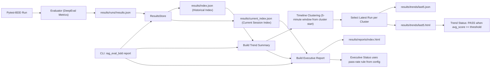

# RAG Eval BDD Framework

Business-friendly and technical RAG evaluation framework built with `pytest-bdd` + DeepEval.

## What this framework does

- Runs BDD scenarios for Layer 1 (retrieval/context quality) and Layer 2 (answer quality).
- Supports tag-based execution (`@smoke`, `@sanity`, `@regression`, metric tags, layer tags).
- Stores every run as JSON under `results/runs/<run_id>/results.json`.
- Generates two HTML reports:
  - `results/reports/index.html`: latest executive report
  - `results/reports/index_<YYYYMMDDTHHMMSS>.html`: timestamped executive snapshots (kept for last 5 reports including latest `index.html`)
  - `results/trends/last5.html`: trend dashboard across recent runs

## Reporting model

### 1) Executive report (latest + timestamped history)

`results/reports/index.html`

- `index.html` always points to the latest generated executive report.
- Timestamped snapshots are stored as `index_<YYYYMMDDTHHMMSS>.html`.
- Retention keeps the latest `index.html` plus up to 4 timestamped snapshots (last 5 reports total).
- Report content shows scenarios executed in the current pytest session.
- Includes business table columns:
  - Metric
  - RunID
  - TimeStamp
  - Type (Inline/External)
  - Threshold
  - Question
  - Expected Output
  - Actual Output
  - Score
  - Result
  - Reason For Score
  - Technical Logs
- "Complete Technical Logs" section is collapsible and links per-run JSON logs.

### 2) Trend report (historical)

`results/trends/last5.html`

- Shows last N timeline clusters (N from `config/config.yaml` -> `reporting.keep_last_n_runs`).
- Cluster rule: runs close in time are grouped into one point using a fixed 5-minute window from cluster start.
- For each cluster, the latest run in that cluster is plotted.
- Trend status rule is threshold-only: if `avg_score >= threshold`, status is `PASS`.
- Used for historical health comparison.

## Quick start

```bash
cd /Users/shubhanshurastogi_1/Learning/rag-session-qa-eval/rag_eval_bdd
source ../.venv/bin/activate
python -m pip install -r requirements.txt

export BASE_URL="http://localhost:8000"
export OPENAI_API_KEY="<your_key>"
```

## Core commands

### Deterministic smoke checks (unit/internals)

```bash
make smoke
```

### Live BDD evaluation

```bash
make live
```

### Live BDD evaluation with notebook-parity behavior

```bash
make live-notebook-parity
```

## Tag-based execution

Use this to run exactly what you want.

```bash
make run-tags TAGS='@smoke'
make run-tags TAGS='@sanity and @layer1'
make run-tags TAGS='@regression and @layer2'
make run-tags TAGS='@contextual_precision'
make run-tags TAGS='@live and @layer1'
make run-tags TAGS='@live and @layer2'
make run-tags TAGS='@live'
```

Notes:
- `@tag` expressions are accepted directly.
- Comma-separated tags are treated as OR.
- Layer and metric tags can be combined.
- Runtime live mode auto-picks the latest document uploaded in the application UI (`http://localhost:5173`).
- Runtime live generation uses `2` questions per layer by default. Override with `RAG_EVAL_LIVE_QUESTIONS_PER_LAYER=<N>`.
- Runtime live generation reuses `data/generated/layer*_live_questions.json` if it already has rows; synthesis runs only when that file is missing or empty.
- Optional fallback (file-path mode): set `RAG_EVAL_LIVE_DOCUMENT` and use the env-based upload step.

## Tag conventions

- `@smoke`: minimal fast BDD scenarios
- `@sanity`: fast confidence scenarios
- `@regression`: broader coverage scenarios
- `@layer1`: contextual precision/recall/relevancy scope
- `@layer2`: answer relevancy/faithfulness/completeness scope
- Metric tags (examples):
  - `@contextual_precision`
  - `@contextual_recall`
  - `@contextual_relevancy`
  - `@answer_relevancy`
  - `@faithfulness`
  - `@completeness`
- `@live`: runtime-generated dataset from the latest document uploaded in application UI

## Current smoke design

There is one dedicated smoke scenario in each layer feature:

- Layer 1 smoke: one inline row, one metric (`contextual_precision`)
- Layer 2 smoke: one inline row, one metric (`answer_relevancy`)

This keeps smoke runs fast and predictable.

## Data and features

- Features:
  - `features/layer1_context_metrics.feature`
  - `features/layer2_answer_metrics.feature`
- Dataset files:
  - `data/datasets/layer1_questions.json`
  - `data/datasets/layer2_questions.json`
  - Runtime-generated live files:
    - `data/generated/layer1_live_questions.json`
    - `data/generated/layer2_live_questions.json`

## Configuration

Main config file:

- `config/config.yaml`

Important sections:

- `thresholds`: metric pass criteria
- `reporting`:
  - `keep_last_n_runs`
  - `trend_status_pass_rate_rule` (used by executive report status rule)
  - `trend_status_min_pass_rate` (used by executive report status rule)
- `evaluation`: performance/cost behavior

## Result storage

- `results/runs/<run_id>/results.json`: full run artifact
- `results/index.json`: recent historical run index (for trends)
- `results/current_index.json`: current session run index (for executive report)
- `results/reports/index.html`: latest executive report
- `results/reports/index_<YYYYMMDDTHHMMSS>.html`: timestamped executive snapshots (last 5 total reports with latest as `index.html`)
- `results/reports/technical_logs.json`: executive report logs payload
- `results/trends/last5.json`: trend data
- `results/trends/last5.html`: trend dashboard

## Architecture (RADVALIDDD view)


```mermaid
flowchart LR
    A["Pytest-BDD Run"] --> B["Evaluator (DeepEval Metrics)"]
    B --> C["results/runs/<run_id>/results.json"]
    C --> D["ResultsStore"]
    D --> E["results/index.json (Historical Index)"]
    D --> F["results/current_index.json (Current Session Index)"]

    G["CLI: rag_eval_bdd report"] --> D
    G --> H["Build Trend Summary"]
    E --> H
    H --> I["Timeline Clustering (5-minute window from cluster start)"]
    I --> J["Select Latest Run per Cluster"]
    J --> K["results/trends/last5.json"]
    J --> L["results/trends/last5.html"]
    L --> M["Trend Status: PASS when avg_score >= threshold"]

    G --> N["Build Executive Report"]
    F --> N
    H --> N
    N --> O["results/reports/index.html"]
    N --> P["Executive Status uses pass-rate rule from config"]
```

## Troubleshooting

### Why does trend include older runs?

Because `last5.html` is historical by design (reads recent runs index).

### Why does one timestamp show one point for multiple runs?

Trend plotting clusters nearby runs in a fixed 5-minute window and shows only the latest run in each cluster.

### Why does `index.html` show only my latest session?

By design, current session index is reset at pytest session start.

### No tests collected

Make sure you run pytest on `steps/` for BDD scenarios, not directly on `.feature` files.

## CI notes

Recommended gate:

1. `make smoke`
2. `make live` or non-blocking live stage depending on environment

Archive `results/` so both business report and trend artifacts are preserved.
